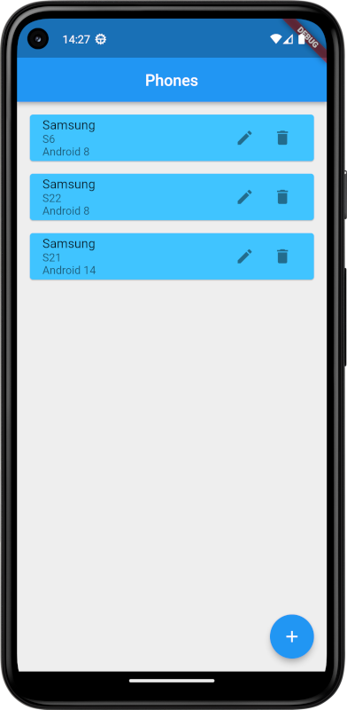
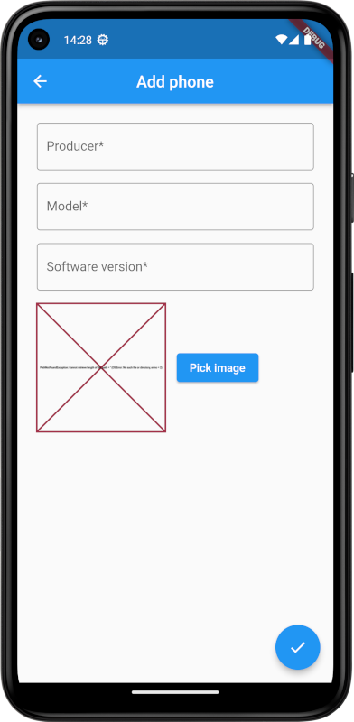
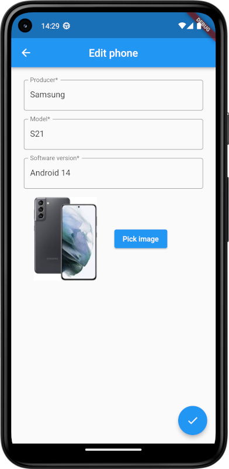

# Table of contents
* [General info](#general-info)
* [Technologies](#technologies)
* [Setup project](#setup-project)
* [Functional Requirements](#functional-requirements)
* [Aplication preview](#aplication-preview)
  
# General info
### Flutter Phone DB
FlutterPhoneDB is an application that allows you to perform CRUD (Create, Read, Update, Delete) operations on data about telephones. The application uses a SQLite database.

# Technologies
Flutter | Dart | SQLite

# Setup project
1. Clone repository.
2. It is recommended to run the application using for example Android Studio:
   - To launch the application: select the device and click 'Run' Icon.  

# Functional Requirements
### Main functionalities of the application: 
- **Adding a new phone:** The user can enter information about the manufacturer, model, software version and can also add a picture showing the device.
- **Editing an existing phone:** Allows you to update the phone data in the database. 
- **Removing the phone:** Allows you to remove unnecessary items from the database.
- **Showing the phones:** Allows you to view a list of existing items.

# Aplication preview
### Home screen of the application

### Screen showing adding a new phone 

### Screen showing editing of an existing phone 

